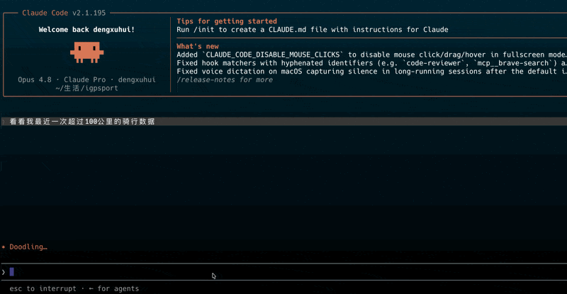

# igpsport-mcp

把 **iGPSport 骑行数据**接入 Claude 等 LLM 客户端的本地 [MCP](https://modelcontextprotocol.io) server。用自然语言分析你的训练:_"我这周训练负荷怎么样?"_ _"对比一下上周和这周的两次长距离骑行。"_ _"我收藏的爬坡赛段排名怎样?"_ _"今年骑了多少公里,有哪些个人最佳?"_ ——还能反过来**让 Claude 给你开课**:_"按我的 FTP 编一节 2×20 SST,推到我的码表 App。"_

**差异化**:NP / IF / TSS / CTL / ATL / TSB 这些派生训练指标在 **MCP 层算好**再返回——LLM 拿到的是可直接讲故事的数字,而不是一堆原始 stream。

```
你:  我最近 90 天的训练负荷趋势?是不是该减量了?
Claude(经由 analyze_training_load):
     当前 CTL(体能)72,ATL(疲劳)91,TSB(状态)-19 —— 处于明显疲劳累积区。
     过去两周 TSS 持续高于 CTL,建议安排 3-5 天恢复周让 TSB 回到 -5 以上……
```

## 演示



> ⚠️ **非官方项目**。本工具通过**模拟 iGPSport 网页端请求**工作,iGPSport 随时可能改接口导致失效;请自行评估账号风险,**风险自负**。纯本地 stdio 运行,**你的数据不经任何第三方服务器**。

## 快速上手(推荐)

本工具是一个 MCP server,需要配合一个**支持 MCP 的客户端**使用(如 [Claude Desktop](https://claude.ai/download) / Claude Code / Cursor)。准备好客户端后,三步即可:

**1. 装 uv**(一个独立小工具,**不需要你先有 Python**,它会自动帮你准备好运行环境):

```bash
# macOS / Linux
curl -LsSf https://astral.sh/uv/install.sh | sh
# Windows(PowerShell)
powershell -c "irm https://astral.sh/uv/install.ps1 | iex"
```

**2. 全局安装并跑一次配置向导**(交互式填手机号/密码,凭证只存在本地)。两个系统命令一样,**macOS 在「终端」、Windows 在「PowerShell」里执行**:

```bash
uv tool install igpsport-mcp
igpsport-mcp --setup
```

> 装完若提示 `igpsport-mcp` 找不到,重开一个终端/PowerShell 窗口让 PATH 生效(uv 会把可执行文件放进 macOS 的 `~/.local/bin`、Windows 的 `%USERPROFILE%\.local\bin`)。

向导会把凭证写到 config.json(权限仅本人可读),并打印一段**可直接粘贴**的 MCP 配置。配置文件位置:

- **macOS**:`~/.igpsport-mcp/config.json`
- **Windows**:`C:\Users\你的用户名\.igpsport-mcp\config.json`

**3. 把打印出来的配置粘到你的客户端**,重启客户端即可(见下「接入 Claude」)。

> 粘贴前想确认账号密码没填错,先跑一次 `igpsport-mcp --check`——它会实际登录一次,打印 ✅ 成功或 ❌ 失败原因,省得加进客户端才发现连不上。
>
> 之后想看粘贴用的配置,随时 `igpsport-mcp --mcp-config` 再打印一次。

---

> 开发者 / 已有环境:直接 `uvx igpsport-mcp` 一次性运行,或用下方的环境变量方式配置,无需走向导。

## 命令行用法

无参数运行即以 stdio 模式启动 MCP server(供客户端拉起,平时不用手动跑)。其余子命令:

| 命令 | 用途 |
|---|---|
| `igpsport-mcp --setup` | 交互式配置向导:填手机号/密码,存到本地 config.json |
| `igpsport-mcp --mcp-config` | 打印可直接粘贴的 MCP 客户端配置 |
| `igpsport-mcp --check` | 实际登录一次,验证凭证是否可用(账号会脱敏显示) |
| `igpsport-mcp --version` | 打印版本号 |
| `igpsport-mcp --help` | 显示帮助 |

## 配置(环境变量)

> 走过 `--setup` 向导的用户**可跳过本节**——凭证已存好。下面适合想用环境变量、或在 CI / 多环境里管理凭证的用户。环境变量优先级高于 config.json。

| 变量 | 必填 | 说明 |
|---|---|---|
| `IGPSPORT_USERNAME` | ✅ | iGPSport 账号(手机号) |
| `IGPSPORT_PASSWORD` | ✅ | 密码 |
| `IGPSPORT_FTP` | 选填 | 功率阈值(瓦)。**不填会自动读取 iGPSport 账号里设置的 FTP**;填了则覆盖 |
| `IGPSPORT_LTHR` | 选填 | 乳酸阈心率(bpm),用于心率区间与 hrTSS 兜底。**不填同样自动从 iGPSport 读取**;填了则覆盖 |
| `IGPSPORT_CACHE_DIR` | 选填 | 缓存目录,默认 macOS `~/.cache/igpsport-mcp`、Windows `C:\Users\你\.cache\igpsport-mcp` |
| `IGPSPORT_LOG_LEVEL` | 选填 | 默认 `INFO` |

> FTP / LTHR 现在默认从你 iGPSport 账号的运动信息里自动读取(还会带出体重、最大心率),所以**通常无需手动填**。只有当你想用与 App 不同的阈值时,才设这两个环境变量来覆盖。若账号里也没设 FTP,则无法计算 IF / TSS / CTL / ATL / TSB —— 请到 iGPSport 里补上,或填 `IGPSPORT_FTP`。

## 接入 Claude

### Claude Desktop

打开配置文件 `claude_desktop_config.json`(没有就新建),粘入下面的内容,然后**完全退出并重开** Claude Desktop。文件位置:

- **macOS**:`~/Library/Application Support/Claude/claude_desktop_config.json`
- **Windows**:`%APPDATA%\Claude\claude_desktop_config.json`(即 `C:\Users\你\AppData\Roaming\Claude\claude_desktop_config.json`)

> 也可在 Claude Desktop 里点 **设置 → Developer → Edit Config** 直接打开这个文件。

**走过 `--setup` 向导**(凭证已在 config.json,`env` 留空即可,这也是 `--mcp-config` 打印的内容):

```json
{
  "mcpServers": {
    "igpsport": {
      "command": "igpsport-mcp",
      "args": [],
      "env": {}
    }
  }
}
```

**或** 不走向导、用 `uvx` + 环境变量:

```json
{
  "mcpServers": {
    "igpsport": {
      "command": "uvx",
      "args": ["igpsport-mcp"],
      "env": {
        "IGPSPORT_USERNAME": "你的手机号",
        "IGPSPORT_PASSWORD": "你的密码"
      }
    }
  }
}
```

> FTP / LTHR 默认自动从 iGPSport 账号读取,无需填写。只有想覆盖 App 里的阈值时,才在 `env` 里加 `"IGPSPORT_FTP": "250"`、`"IGPSPORT_LTHR": "160"`。

### Claude Code

走过向导(凭证已存好):

```bash
claude mcp add igpsport --scope user -- igpsport-mcp
```

或用 uvx + 环境变量:

```bash
claude mcp add igpsport --scope user \
  --env IGPSPORT_USERNAME=你的手机号 \
  --env IGPSPORT_PASSWORD=你的密码 \
  -- uvx igpsport-mcp
```

加完用 `/mcp` 或 `claude mcp list` 确认状态为 connected。

> **连不上?** 先在终端跑 `igpsport-mcp --check` 把问题分开:
> - 报 ❌ 登录失败 → 是账号密码问题,重跑 `igpsport-mcp --setup`。
> - 报 ✅ 成功但客户端仍连不上 → 多半是 `igpsport-mcp` / `uvx` 不在客户端的 PATH 里(尤其 Claude Desktop 常取不到登录 shell 的 PATH)。把配置里的 `command` 换成可执行文件的**绝对路径**:
>
> - **macOS**:终端跑 `which igpsport-mcp`(或 `which uvx`),如 `/Users/你/.local/bin/igpsport-mcp`。
> - **Windows**:PowerShell 跑 `where.exe igpsport-mcp`(或 `where.exe uvx`),如 `C:\Users\你\.local\bin\igpsport-mcp.exe`。JSON 里反斜杠要写成双反斜杠,例如 `"command": "C:\\Users\\你\\.local\\bin\\igpsport-mcp.exe"`。

## 更新

**`uv tool install` 安装的**(两个系统一样),升级到最新版:

```bash
uv tool upgrade igpsport-mcp
```

升级后重启客户端(Claude Desktop 完全退出再开;Claude Code 重连即可)。看当前版本:`igpsport-mcp --version`。

> **`uvx igpsport-mcp` 一次性运行的**无需手动升级——uvx 默认用最新版。若本地缓存了旧版,用 `uvx igpsport-mcp@latest` 或清缓存 `uv cache clean` 后再跑即可拿到最新。

## 卸载

**1. 卸载程序本体**(两个系统一样):

```bash
uv tool uninstall igpsport-mcp
```

**2. 删除本地凭证与缓存**(可选,彻底清干净):

```bash
# macOS / Linux(终端)
rm -rf ~/.igpsport-mcp        # 凭证 config.json
rm -rf ~/.cache/igpsport-mcp  # token、SQLite、FIT 文件缓存
```

```powershell
# Windows(PowerShell)
Remove-Item -Recurse -Force "$env:USERPROFILE\.igpsport-mcp"
Remove-Item -Recurse -Force "$env:USERPROFILE\.cache\igpsport-mcp"
```

**3. 从客户端配置里移除 `igpsport`**:Claude Desktop 删掉 `claude_desktop_config.json` 里 `mcpServers` 下的 `igpsport` 块;Claude Code 用 `claude mcp remove igpsport`。

> 用 `uvx igpsport-mcp` 一次性运行的没有「本体」需要卸载,只需做第 2、3 步即可。

## 提供的 16 个工具

**活动与训练(8)**

| 工具 | 用途 |
|---|---|
| `list_activities` | 列出活动(支持日期范围、分页) |
| `get_activity_summary` | 单次活动派生指标(NP/IF/TSS/work、心率与功率区间停留时间) |
| `get_activity_streams` | 时间序列(强制降采样 + 通道选择,token 友好) |
| `get_activity_laps` | 圈/分段数据(逐圈 NP) |
| `get_athlete_profile` | 训练参数:FTP/LTHR(自动读 iGPSport 或用环境变量覆盖);体重、最大心率始终从 iGPSport 读取;含区间边界 |
| `get_athlete_stats` | 周期聚合统计(本地从活动列表算) |
| `compare_activities` | 多次活动对比(2–5 条) |
| `analyze_training_load` | CTL/ATL/TSB 趋势 + 状态解读(杀手 query) |

**赛段(3)**

| 工具 | 用途 |
|---|---|
| `list_segments_collected` | 我收藏(收星)的赛段列表,含我的最好成绩 |
| `get_segment_detail` | 赛段详情:距离/坡度/爬升 + KOM + 最快榜 + 我的 PR |
| `get_segment_rank` | 赛段排行榜(`query_type` 1=总榜、2=年度等),含我的排名 |

**统计与成就(1)**

| 工具 | 用途 |
|---|---|
| `get_member_statistics` | 官方年度统计与个人最佳:总里程/时长/卡路里/TSS、逐月里程、距离里程碑、各项 PR(最远/最久/最快/最大功率/最大爬升) |

**训练课程(4)** — 唯一的「写回」能力

| 工具 | 用途 |
|---|---|
| `create_workout` | 用自然语言描述结构化训练课(热身/主课/间歇/恢复),编译成 iGPSport 原生格式并推到你的码表 App;支持 `dry_run=true` 先预览不发送;`with_calendar=true` 额外返回一段标准 iCalendar(`VEVENT`)产物,可让 LLM 转手写进苹果日历 / 提醒事项 / Notion 等下游工具 |
| `list_workouts` | 从服务端实时拉取全部自定义课程(App 端删除也会同步反映) |
| `get_workout_detail` | 拉取某节课程的完整结构 |
| `delete_workout` | 删除课程。**破坏性、不可恢复**:默认只返回确认预览,需再带 `confirm=true` 才真正删除 |

> 功率目标支持绝对瓦数、%FTP(用你的 FTP 自动换算)、功率区间;也支持心率、踏频、速度目标。时长可按时间/距离/卡路里/手动按圈。课程创建后会出现在 iGPSport App 的「训练课程」里,可同步到码表执行。

## 派生指标说明

- **NP**(标准化功率):`((30s 滑动均值)^4 的均值)^0.25`,计算前 stream 重采样到 1Hz。
- **IF** = NP / FTP;**TSS** = `时长 × NP × IF / (FTP × 3600) × 100`。
- **CTL / ATL / TSB**:日 TSS 的指数加权(α=1/42、1/7),TSB = CTL − ATL。
- **无功率计兜底**:hrTSS = `(时长/3600) × (平均心率/LTHR)² × 100`,会标注 `estimated from HR`。
- **区间模型**:心率用 Friel(基于 LTHR),功率用 Coggan 7 区(基于 FTP)。

## FAQ

**Q:必须有功率计吗?**
A:不必。没功率计时心率相关指标照常,TSS 走 hrTSS 兜底(精度较低,会标注)。但建议填 FTP 以解锁功率指标。

**Q:数据会上传到哪里吗?**
A:不会有第三方。除了向 iGPSport 读写**你自己账号**的数据(读活动/统计,以及 `create_workout`/`delete_workout` 时写你自己的训练课程),一切都在本地;FIT 文件与派生指标缓存在本地。

**Q:`create_workout` / `delete_workout` 会乱动我的数据吗?**
A:`create_workout` 只新增训练课程,可先 `dry_run=true` 预览编译结果再决定是否发送。`delete_workout` 是不可恢复操作,默认只返回确认预览,必须显式 `confirm=true` 才真正删除——所以 LLM 不会在你没确认时删掉课程。

**Q:`with_calendar` 会自动写我的日历吗?**
A:不会。本服务**只产出**一段标准 iCalendar(`VEVENT`)文本,自己绝不碰任何日历 API、也不外发数据。是否真正写入,由你的 LLM 客户端把这段产物转交给另一个日历/提醒类工具(如苹果日历、提醒事项、Notion 的 MCP)来决定。训练课是没有执行日期的模板,所以 `DTSTART` 是占位符 `{{SCHEDULED_DATE}}`,具体排到哪天由下游填。

**Q:接口失效了怎么办?**
A:iGPSport 改版可能导致失效,工具会抛出明确错误。欢迎到 [Issues](https://github.com/dengxuhui/igpsport-mcp/issues) 反馈。

**Q:支持跑步/其它码表吗?**
A:不支持。本项目专注 iGPSport 骑行数据。

## 开发

```bash
uv sync --extra dev
uv run pytest            # 测试
uv run pytest -m integration   # 联网集成测试
ruff check . && ruff format .  # lint/format
```

## License

[MIT](LICENSE)。本项目与 iGPSport 官方无任何关联。
